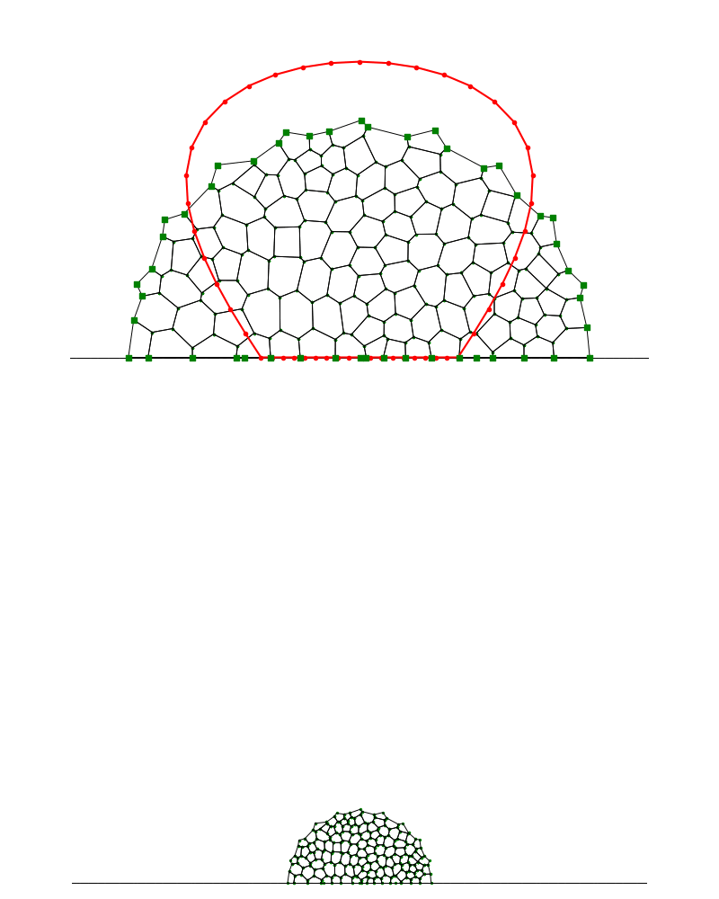

# diff-tissue

<p align="center">
  
</p>

## Differentiable Tissue Morphogenesis
This repository provides a differentiable vertex model for simulating and
optimizing plant tissue morphogenesis. It combines a vertex-based tissue model
with differentiable simulation. Keeping the simulation differentiable allows
model parameters and growth rules to be optimized or potentially learned from
data, enabling new workflows in computational biology and developmental
modeling.

The code accompanies:

> Skjegstad et al. (2026), *Differentiable Vertex Model: Exploring Gradient-Based
> Optimization for Tissue Morphogenesis*.

[bioRxiv preprint](https://doi.org/10.64898/2026.05.07.723189)

---

## Installation

Clone the repository:

```bash
git clone https://github.com/larserik-js/diff-tissue.git
cd diff-tissue
```

Create a virtual environment and install dependencies defined in `pyproject.toml` using your preferred tool. The examples below assume that the `python` command refers to the interpreter in this environment.

---

## Usage

Run the main optimization pipeline:

```bash
python scripts/run_shape_opt.py
```

This script performs optimization of cell-level parameters, based on a tissue-level target boundary. The optimization runs for a maximum of 1000 steps, and converges when the loss does not improve over 50 steps. After this, two visualization steps are performed, which produce:

* Final optimized tissues for different optimization steps in `outputs/final_tissues/`
* Visualization of the best-loss morphogenesis process in `outputs/best_morph/`

Note that for a given set of parameters, the program caches intermediate simulation data in the `data/` folder. This means that if the program is rerun with the same parameters, the optimization step is skipped, and only the visualization steps are rerun (which produces the exact same outputs).

The script can also be run with custom parameters, for example:

```bash
python scripts/run_shape_opt.py --shape trapezoid --id 1 --seed 10
```

Parameters:

* `--shape`: target geometry
* `--id`: regional cell identity configuration
* `--seed`: random seed controlling mesh initialization

For a full list of parameters, see `src/diff_tissue/app/parameters.py`.

There are a few tests included for development purposes. They can be run with the `pytest` command.

---

## Project Structure

```
diff_tissue/
├── scripts/          # Entry points and experiments
├── src/
│   └── diff_tissue/
│       ├── api/          # API-related code
│       ├── app/          # Application-level logic and configuration
│       └── core/         # Core simulation and modeling code
├── tests/            # Test functions
├── pyproject.toml    # Dependencies and project metadata
└── README.md
```

---

## License

This project is licensed under the MIT License.
